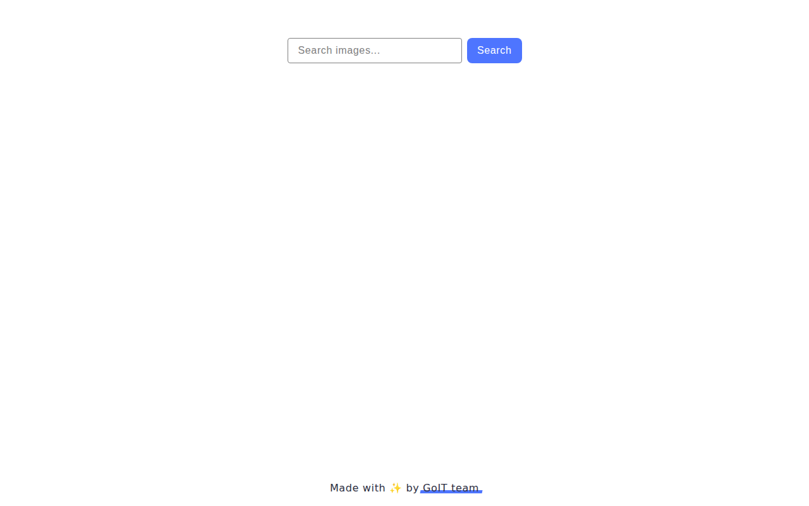

### 🌐 Виберіть для Вас комфортну мову:

[🇺🇦 Українська](README.md) | [🇬🇧 English](README.en.md) |
[🇩🇪 Deutsch](README.de.md)

# GoIT JS HW-11 — Image Search (Pixabay API)

<!-- AUTOGEN:STATS -->
[](https://developer.mozilla.org/en-US/docs/Web/JavaScript) [](https://developer.mozilla.org/en-US/docs/Web/CSS) [](https://developer.mozilla.org/en-US/docs/Web/HTML) [](https://support.apple.com/guide/terminal/welcome/mac) [](https://code.visualstudio.com/) [](https://github.com/) [](https://www.figma.com/) 

[](https://github.com/VuToV-Mykola/goit-js-hw-11/graphs/traffic)
[](https://github.com/VuToV-Mykola/goit-js-hw-11/actions/workflows/screenshot-and-visitor.yaml)
[](https://github.com/VuToV-Mykola/goit-js-hw-11)
[](https://github.com/VuToV-Mykola/goit-js-hw-11/blob/main/LICENSE)

## 📸 Скріншот проекту

<!-- END:AUTOGEN -->

## 🎯 Про проєкт

Домашнє завдання №11 з JavaScript. Пошук зображень через **Pixabay API**:

- форма пошуку (`.form`, `name="search-text"`), галерея результатів;
- SimpleLightbox для перегляду збільшених зображень;
- індикатор завантаження (loaders.css) та сповіщення через `iziToast`.

## 🧩 Функціонал

- Пошук зображень за ключовим словом (Pixabay API, Axios).
- Галерея з картками (webformatURL, largeImageURL, tags, likes, views, comments, downloads).
- Модальне вікно SimpleLightbox по кліку на картку.
- Loader перед запитом / приховування після відповіді; iziToast при порожніх результатах та помилках.

## 🛠 Технології

- HTML5, CSS3, JavaScript (ES2025)
- Vite, Axios, iziToast, SimpleLightbox, loaders.css
- Pixabay API

## 🔌 Pixabay API key

1. Отримати ключ: [Pixabay API](https://pixabay.com/api/docs/).
2. Створити файл `.env` у корені проєкту (поруч із `package.json`):
   ```bash
   cp .env.example .env
   ```
3. Відкрити `.env` і вписати свій ключ:
   ```
   VITE_PIXABAY_API_KEY=ваш_ключ
   ```

## 📁 Структура

```
goit-js-hw-11/
├── src/
│   ├── index.html
│   ├── main.js
│   ├── css/
│   │   ├── styles.css
│   │   ├── base.css
│   │   ├── reset.css
│   │   ├── container.css
│   │   ├── header.css
│   │   ├── footer.css
│   │   └── image-search.css
│   └── js/
│       ├── pixabay-api.js
│       └── render-functions.js
├── .env.example
├── package.json
└── README.md
```

## 🚀 Запуск

1. Встановити залежності:
   ```bash
   npm install
   ```
2. Налаштувати `.env` (див. розділ «Pixabay API key»).
3. Запустити dev-сервер:
   ```bash
   npm run dev
   ```
4. Відкрити: `http://localhost:5173/` або `http://localhost:5173/index.html`.

## ✅ Валідація

- HTML: https://validator.w3.org/
- CSS: https://jigsaw.w3.org/css-validator/
- JS: https://jshint.com/

## 🔗 Корисні посилання

- [Технічне завдання](https://www.edu.goit.global/ru/learn/35708569/18936918/20829841/homework)
- [Pixabay API](https://pixabay.com/api/docs/)
- [Stylelint Rules](https://stylelint.io/user-guide/rules)
- [Code Guide](https://codeguide.co/)
